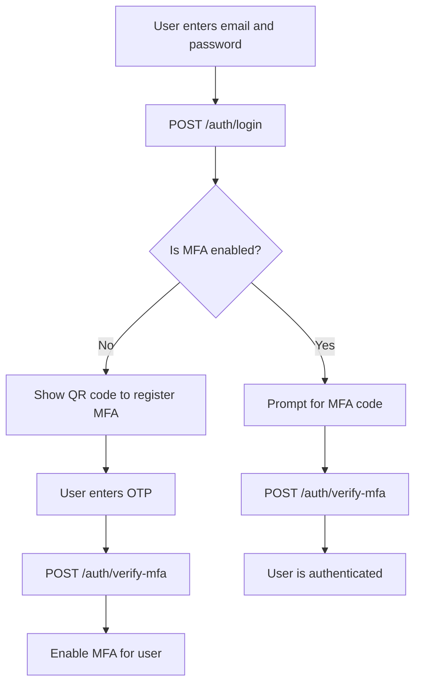

# 🛡️ Multi-Factor Authentication (MFA) POC with NestJS and React

This is a proof of concept (POC) project that demonstrates how to implement Multi-Factor Authentication (MFA) using:

- 🔧 **NestJS** for the backend
- ⚛️ **React (with TypeScript)** for the frontend
- 🔐 **TOTP-based MFA** (compatible with Google Authenticator)
- 🐘 **PostgreSQL** as the database

---

## 🧠 Overview

This project demonstrates a secure login flow where:

1. The user logs in with **email + password**.
2. If MFA is **not enabled**, the app prompts the user to **scan a QR code** and register MFA using Google Authenticator.
3. Once registered, every future login will request the **MFA code** after validating the password.

---

## 🔁 Authentication Flow



---

## 🚀 Tech Stack

**Backend**\
NestJS\
TypeORM\
PostgreSQL\
otplib (for generating and validating TOTP codes)

**Frontend**\
React (TypeScript)\
Mantine UI for component styling\
Axios for HTTP requests

---

## 🧪 Running Locally

**1. Clone the repository**

```bash
git clone https://github.com/your-username/mfa-poc-nestjs-react.git
cd mfa-poc-nestjs-react
```

**2. Backend Setup**

```bash
cd backend
cp .env.example .env
npm install
npm run migration:run
npm run start:dev
```

**3. Frontend Setup**

```bash
cd frontend
npm install
npm run start
```

---

## 🧩 Future Improvements

- Email fallback MFA option
- Recovery codes
- Rate limiting on failed OTP attempts
- Push-based MFA or WebAuthn

---

## 📄 License

MIT License

---

> Developed as a security-focused experiment using modern NestJS and React architecture.

